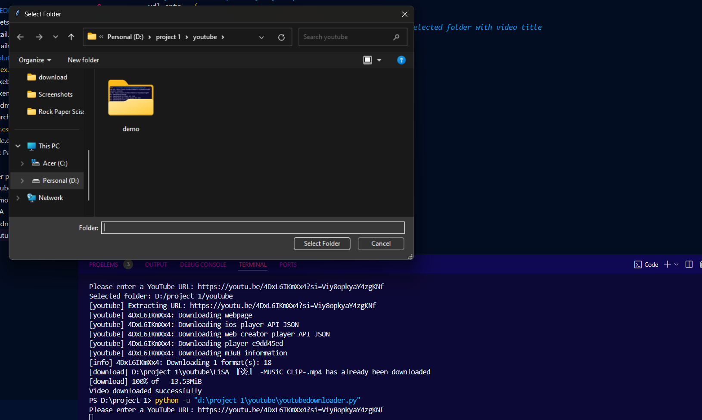
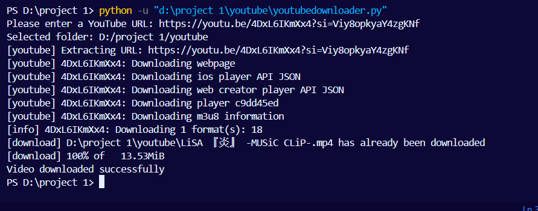

# YouTube Video Downloader

A simple Python application that allows users to download YouTube videos in the highest available quality. It uses the `yt-dlp` library to handle the downloads and `tkinter` for selecting the destination folder.

## Features

- Downloads YouTube videos in the best available resolution.
- Lets you select a folder to save the video using a graphical interface.

## Installation (Windows)

Follow these steps to get the project up and running on Windows:

### 1. Install Python

If you don't have Python installed, download and install it from the [official Python website](https://www.python.org/downloads/). Make sure to check the option to **"Add Python to PATH"** during installation.

### 2. Install Required Libraries

Open the Command Prompt and install the required libraries:

1. **yt-dlp** (for downloading videos from YouTube):
   ```bash
   pip install yt-dlp

   pip install tk


## Demo

Here's a demo of the application in action:




## Demo Video

You can watch the demo video [here](downlaod/LiSA%20『炎』%20-MUSiC%20CLiP-.mp4).

### 3. Run the Program

To run the Python script, execute the following command in your Command Prompt:

```bash
python downloader.py


